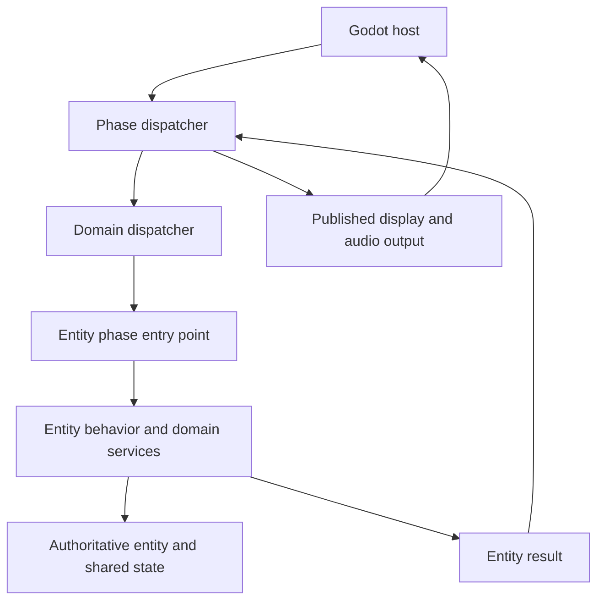

# Godot migration architecture

**Scope: planning for the future, currently unstarted Godot migration only.**
Apply this guidance only when explicitly working on that migration. It does not
apply to ongoing development, bug fixes, lookup-table work, or other tickets in
the existing C# implementation. It creates no new acceptance gates, service or
interface requirements, or refactoring obligations for that work. The source
examples below explain future migration constraints; they are not a cleanup queue
or instructions to change those files now. Writing or reading this plan does not
start the migration or authorize switching away from the active ticket.

This document guides implementation of a full Godot project with editable scenes
while retaining the original game logic expressed by the C# port. Its audience is
the developer or implementing AI making decisions as dependencies are uncovered.
It describes which approaches to prefer under particular constraints, the reasons
for those preferences, and the behavior that each choice must preserve.

The architectural direction is phase dispatch through entities into domain
services. The dispatcher preserves execution semantics; entities and services
preserve operation semantics. Shared state becomes an explicit relationship
between objects with appropriate lifetimes. Editable Godot scenes are the intended
authoring environment; a host that only displays the existing framebuffer is a
possible intermediate milestone.

This is future migration design guidance, not a completed phase inventory or an
implementation.
Architecture alone does not prove frame parity. Preserving the selected C# baseline
and correcting a discrepancy from the cartridge are separate changes. Follow
[AGENTS.md](../AGENTS.md) for ticket ownership, confirmation scope, original-source
references, error handling, publication, and the bounded-emulation scope. This
document does not authorize starting another ticket while one is in progress.

## How to use this plan

For each proposed extraction or integration, identify the applicable constraints
below from current source and its callers. Use the preferred approach when it
preserves the described contract. Where it cannot, record the concrete mismatch
and an alternative that preserves the contract. An unexplained preference for
engine conventions is insufficient reason to change game behavior.

Names such as `IWeaponCooldown`, `RunAlpha`, and `RunBeta` illustrate possible
contracts. Establish the actual interfaces and phase boundaries from the code
being moved. Movement, attack, damage, and death are behavior domains; they do not
automatically correspond to separate global phases.

The source examples were inspected during this design discussion, including the
checkout at `a3820e4daba563da0714fea7f9f543e3cae66c7e`. They are navigation aids and
concrete evidence of constraints, not an exhaustive audit or a required future
migration baseline. Recheck the relevant implementation when working on a slice.

## Execution and ownership model



The return to the dispatcher can select the next entity, a nested pass, a branch,
a continuation, or completion of the current simulation step. It is a synchronous
control-flow relationship; an asynchronous event bus is not implied.

| Owner | Responsibility |
| --- | --- |
| Godot host | Engine integration, input collection, scene authoring, device output, and presentation. |
| Phase dispatcher | Select the applicable control flow and preserve global order, branching, repetition, suspension, and completion. |
| Domain dispatcher | Preserve a domain's traversal, nested per-entity order, admission rules, and allocation semantics. |
| Entity | Own or reference authoritative state, expose applicable phase entry points, execute entity-specific behavior, and invoke its services. |
| Shared service | Implement reusable domain operations and own shared state where the domain requires it. |
| Composition root | Construct a simulation session, bind dependency instances, and establish their lifetimes and capabilities. |

When behavior is specific to one enemy, prefer the enemy or a dedicated behavior
component as its owner. When the operation is shared, prefer a domain service.
For example, an enemy can decide to attack and ask a shared projectile service to
allocate the shot. The dispatcher should know the execution point without
encoding that enemy's attack pattern.

Prefer services with coherent responsibilities and explicit dependencies. A clean
service boundary does not imply independent state or freedom to reorder calls.
Keep engine types outside reusable simulation contracts where possible, so the
same phase path can run under the existing confirmation tools.

## Phase dispatch under ordering constraints

### Interleaved work

When another actor's work occurs between two parts of an entity's behavior, prefer
multiple phase entry points on that entity. Preserve one authoritative state
across those calls and explicitly retain observations that later calls need.

For Samus, the current runtime prepares terrain interaction, performs alpha work,
runs enemies, then proceeds into beta. Moving platforms can contribute displacement
between preparation and movement. An entity can encapsulate its part of each
operation while the dispatcher preserves that interleaving. See
[`PrepareEnemyFrame` and `RunEnemyMainPhase`](../csharp/src/SuperMetroid.Core/Runtime/SuperMetroidRuntime.EnemyPhase.cs).

When ordering is nested, prefer nested dispatchers or explicit nested schedules.
The following is only a partial ordinary-gameplay example; conditional branches
and specialized handlers must be established from the current implementation:

```text
Samus alpha including applicable projectile production and update
Enemy pass
    Build the eligible native slot list
    For each selected slot in its original order
        Perform applicable collision and damage work
        Select and execute AI
        Perform applicable instruction processing
        Admit draw work and perform remaining timer work
Samus beta
```

Preserve collision-before-AI within each enemy's turn. A global pass over all
collisions followed by a global pass over all AI has a different mutation order.
Likewise, phase numbers sorted ahead of slot numbers cannot represent every nested
schedule. See [`RoomEnemySystem.StepFrame`](../csharp/src/SuperMetroid.Core/Game/RoomEnemySystem.cs)
and [`ResolveOrdinaryProjectileHits`](../csharp/src/SuperMetroid.Core/Game/RoomEnemySystem.OrdinaryCombat.cs).

### Immediate effects and retained observations

When an operation's result affects a later operation in the same pass, prefer
typed synchronous calls and immediate mutation through the designated owner.
Preserve the original order of target traversal, hitbox traversal, projectile
selection, side effects, and early exits. Use deferred commands only where the
original path actually defers the effect, and name their consumption point.

When a decision uses an earlier observation, carry that observation explicitly.
The current enemy loop records `invincibleAtEntry` before decrementing the timer;
the call that reaches zero still skips collision. Reading the current timer in a
new collision callback would change the result. Distinguish retained observations
from values that intentionally must be read live after another phase mutates them.

When eligibility can change during a frame, evaluate it at the original decision
point. A frame-start mask of all enabled phases is appropriate only if the source
establishes that those decisions are all latched there. Keep phase-scoped temporary
state in an explicit frame context when extraction would otherwise lose a local.

### Suspension and continuation

When execution suspends partway through a state machine, prefer explicit saved
continuation state describing the resume point and pending operation. Preserve
the work that continues around the suspension and whether closing the wait returns
immediately or continues the current pass. Generic asynchronous waits and a global
pause flag must not invent the continuation behavior.

Message boxes, save prompts, suit transformations, X-ray, game pause, and host
suspension have different contracts. The current message path retains pending
save or suit work; the enemy loop can decrement invincibility while movement is
frozen. Use the actual per-operation rules in
[`SuperMetroidRuntime`](../csharp/src/SuperMetroid.Core/Runtime/SuperMetroidRuntime.cs)
and the frontend dispatcher rather than treating these states as interchangeable.

### Failure boundaries

When moving operations across methods or services, preserve their cleanup and
commit boundaries. The runtime's `finally` restores borrowed ammo and demo input;
door loading prepares assets before consuming the pending door. These are relevant
to the existing recoverable-error policy.

Prefer one guarded host boundary and explicit domain recovery where already
defined. Catching an exception independently in every participant and continuing
the phase list could execute later phases against incomplete state. Do not add
automatic phase retries without accounting for side effects already performed.
Maintain the no-dialog error policy required by AGENTS.md.

## Entity contracts and registration

### Capabilities and metadata

When the dispatcher must invoke a known operation, prefer a typed interface or
equally explicit compile-time contract. An entity may implement several meaningful
phase contracts. Illustrative interfaces include `ISamusAlphaParticipant`,
`ISamusBetaParticipant`, and `IEnemyAiParticipant`; avoid requiring every entity to
implement every phase with empty methods.

When identity, order, or lifetime information is required, prefer an explicit
registration record. It should establish the owning dispatcher, authored ordinal
or physical slot, supported handlers, and admission/removal semantics.

Attributes may help editor discovery or generate registration code. If used, prefer
validated metadata with one source of truth. Attributes should not silently invent
execution order, duplicate an interface's participation declaration, or require
unvalidated string dispatch. A reflection or DI framework is not prescribed here.

Keep these concepts separate:

| Concept | Contract |
| --- | --- |
| Registration | The entity exists in this domain and has a known identity and lifetime. |
| Participation | The entity implements a particular phase operation. |
| Eligibility | That operation should execute at this point under the applicable rules. |

Register independently scheduled gameplay entities with their owning dispatcher.
When a subsystem owns a fixed pool of records, its registry may be that pool; it
does not require one Godot node per record. Decorative nodes need no simulation
registration. Multipart visuals and multipart native actors must be distinguished
by their actual scheduling and slot requirements.

### Initialization and dynamic lifetime

When initialization order is observable, prefer collecting scene declarations and
validating them before activating gameplay in the original order. Descriptor
collection must not execute initialization AI early. Preserve sequential record
installation and initialization when an initializer reads a preceding slot.
Godot lifecycle callback arrival order should only establish bindings under this
design; it should not determine population order.

The current population loader initializes each record before advancing to the
next. The gunship bottom accesses preceding physical slots during initialization.
Keep the 32-slot layout, empty slots, adjacency, and native index meanings where
consumers rely on them. See `LoadPopulation` and `InitializeGunshipBottom` in
[`RoomEnemySystem`](../csharp/src/SuperMetroid.Core/Game/RoomEnemySystem.cs).

When entities spawn or disappear during a pass, specify separately:

- When storage is allocated and initialization executes.
- When the new occupant becomes eligible for this or a later pass.
- When logical deletion takes effect and when storage becomes reusable.
- When the corresponding Godot representation is created or freed.

Prefer the domain's original rules over a universal end-of-frame mutation queue.
Preserve capacity and exhaustion behavior: the current
[`Mother Brain falling-tube spawn`](../csharp/src/SuperMetroid.Core/Game/RoomEnemySystem.MotherBrainFakeDeath.cs)
returns without spawning when the enemy pool is full. Other paths have their own
failure contracts.

When iteration snapshots identities, preserve what the snapshot contains. The
enemy loop records native slot indices, then resolves the current slot during
iteration. Snapshotting entity references instead can change replacement behavior.
Use generations to protect host bindings from stale visual callbacks where needed,
but do not change a native gameplay link's deliberate slot-alias semantics by
silently giving it a different identity model.

## Shared state and dependency injection

### One storage identity across several consumers

When multiple systems read and write one original value, prefer one shared state
instance injected into all relevant consumers. Keep a single authoritative value
even when separate interfaces expose different read or write capabilities.
Entity-private state remains private where the source establishes independence.

The current weapon systems share one cooldown. A possible `IWeaponCooldown`
instance would be referenced by missiles, beams, and bombs. The designated phase
operation advances it; consumers read or replace it at their original call sites.
Injecting the instance into more entities must not multiply its advancement.

Preserve the exact timer contract: width, wrapping, read interpretation, decrement
point, and side effects. A generic `ICountDown` is appropriate only if it expresses
those semantics. A timer measured in engine seconds is not an equivalent substitute
for a wrapping simulation word.

When several names are views of one storage location, prefer typed views backed
by that single location. When similarly named timers are independent, provide
separate instances. Do not infer storage identity from matching names or values.

Some values that look derivable are independently authored state. For example,
the bomb counter can be assigned to suppress allocation without creating bombs.
Preserve it rather than deriving it from the number of registered entities. See
[`SamusBombProjectileSystem`](../csharp/src/SuperMetroid.Core/Game/SamusBombProjectileSystem.cs).

### Lifetimes and service composition

When mutable state belongs to a game session, prefer a DI instance scoped to that
session. This supports independent editor previews, confirmation sessions, and
restored games. Process-wide mutable statics should not connect otherwise separate
simulations. Static immutable definition catalogs remain appropriate.

Choose lifetimes from the state contract, not from scene hierarchy alone:

| Situation | Preferred lifetime |
| --- | --- |
| State must survive entity destruction or ordinary room transitions | Session-owned instance, retained across those transitions. |
| State is recreated for a room or encounter | Explicit room or encounter scope with defined entry and teardown operations. |
| State belongs only to one actor | Entity instance, with the original initialization and replacement rules. |
| Content is shared and immutable | Shared definition or asset instance; mutable runtime state uses a separate owner. |

Bind dependencies before the phase that requires them. Prefer constructor or
explicit composition-time injection over repeatedly resolving services inside
simulation callbacks. Expose domain operations instead of a service locator or
an unrestricted world object that recreates the current coupling under one name.

Shared code does not require shared mutable state. A movement algorithm may work
on each actor's private kinematics, while a projectile allocator owns a shared
pool. Conversely, multiple services may require restricted access to one shared
word. Ownership and permitted access should be recorded independently.

### Random state

When behavior uses the original shared RNG, preserve both the shared instance and
the sequence of reads, advances, and explicit writes. Giving every enemy the same
seed in a private generator does not preserve that sequence.

Menu frames participate in RNG progression, and runtime release preserves the
value. Some HDMA effect work mutates it before the gameplay prologue advances it.
Only the established reset path should reseed it. Presentation previews and added
cosmetic effects must not consume the gameplay stream. See
[`SuperMetroidGame.Random`](../csharp/src/SuperMetroid.Core/Frontend/SuperMetroidGame.Random.cs)
and `StepFrameGuarded` in the runtime.

## Godot timing and presentation boundaries

### One owner of simulation advancement

When a Godot callback can trigger a complete simulation step under the required
host policy, prefer a single coordinator using the normal `SceneTree`. It can
dispatch several synchronous phases inside one `_PhysicsProcess` invocation.
Gameplay participants should receive those explicit calls rather than also
advancing authoritative state through independent engine callbacks.

Godot permits a custom `MainLoop`. Prefer replacing it only when an identified
integration constraint requires control unavailable through the coordinator;
phase dispatch alone does not require an engine fork or loop replacement.
[Godot MainLoop reference](https://docs.godotengine.org/en/stable/classes/class_mainloop.html)

When a simulation worker is necessary, give that worker sole ownership of the
same scheduler and communicate with Godot through explicitly owned input and
output buffers. Do not also advance the game from physics callbacks. Prefer
serial execution of authoritative phases while preserving shared mutation order;
task completion order must not become gameplay order.

Treat callback selection and host cadence as decisions to establish for the
target build. The inspected desktop runs at 60 frames per second with a four-frame
catch-up cap, while `HostFrameTimingDefinitions` specifies a two-frame cap. Godot
also has its own physics rate, maximum steps per rendered frame, and timing
adjustment settings. Record the chosen baseline, catch-up behavior, long-stall
policy, pause/resume behavior, and audio relationship. Do not combine migration
with an unrequested correction to cartridge wall-clock cadence.
[Godot Engine reference](https://docs.godotengine.org/en/stable/classes/class_engine.html)

When frame-counted logic advances, prefer complete original simulation steps.
Passing elapsed time into the existing arithmetic, interpolating authoritative
positions, or dropping an internal phase changes the contract. Presentation may
replace superseded pictures without discarding the simulation work that produced
them. Host missed frames and the modeled distinction between accepted and lagged
NMIs are separate concepts.

### Input and audio

When inputs arrive between simulation samples, preserve held state and pending
edges until their designated sampling point. Sample and record the controller
word once for each admitted simulation step. A render frame may contain several
steps; render callback frequency must not consume input edges or duplicate them.
Preserve source merging, simultaneous directions, bindings, and focus-loss policy
as defined by the selected host contract. The existing
[`FrameInputLatch`](../csharp/src/SuperMetroid.Core/Input/FrameInputLatch.cs)
preserves a complete tap between samples.

When audio acknowledgements affect dispatch, keep simulated audio advancement
inside the session's ordered frame contract. Apply the frame's commands, generate
its samples, and make the resulting acknowledgements available at the original
boundary. Device playback callbacks consume output; device latency must not select
gameplay acknowledgement timing. Specify output mute and device-failure behavior
without accidentally changing simulated audio progression.

When output storage is reused, give the consumer a copy or an explicit ownership
handoff. `CartridgeAudioRenderer.RenderFrame` returns an array borrowed until the
next call. Enqueuing that same array repeatedly can overwrite queued samples.
See [`CartridgeAudioRenderer`](../csharp/src/SuperMetroid.Core/Audio/CartridgeAudioRenderer.cs)
and the current host frame loops.

### Simulation position and visible position

When movement has exact integer or fixed-point semantics, keep that representation
authoritative in the entity and its services. A movement result includes the
required state changes and side effects, not merely a floating-point position.
Project the appropriate result into Godot coordinates without feeding rounded or
interpolated presentation coordinates back into the simulation.

When existing draw routines mutate gameplay state, preserve those operations as
simulation phases before replacing their graphics output. Samus's draw epilogue
updates input history, and drawing also participates in palette and other state
progression. That work must run under its original eligibility rules even when
the host does not display a picture. See
[`SamusState.InputSnapshot`](../csharp/src/SuperMetroid.Core/Game/SamusState.InputSnapshot.cs)
and [`SuperMetroidRuntime.ActorDrawing`](../csharp/src/SuperMetroid.Core/Runtime/SuperMetroidRuntime.ActorDrawing.cs).

When display state is latched before subsequent gameplay changes, publish the
latched state. `RunNmi` copies finalized OAM and display registers and drains
transfers in a defined order. Publishing the latest live actor transform can
change visual timing even with identical simulation positions. Prefer an explicit
display snapshot boundary such as the existing
[`StepCaptured`](../csharp/src/SuperMetroid.Core/Frontend/SuperMetroidGame.RenderCapture.cs).
Repainting or attaching a view must not advance simulation or rerun draw side effects.

When stock rendering semantics depend on sprite priority, palette arithmetic,
windows, scanline effects, or Mode 7, prefer a presentation backend that implements
those semantics explicitly. Ordinary Godot sprite composition is suitable only
where it preserves the required result. Existing software output and
[render packets](../csharp/RENDER_PACKET_FORMAT.md) are useful staged boundaries.

## Sprite and animation migration

The finished Godot project needs composed, inspectable, editable actor animations.
Importing the current tile sheets as textures alone does not meet that goal.
Treat sprite conversion as a migration workstream alongside scene conversion,
with the same future-only scope as this document.

### Existing artwork and animation ownership

The current representation separates indexed pixels, composition, visual selection,
and animation mechanics. These inspected sources provide starting boundaries:

| Existing source | Migration-relevant information |
| --- | --- |
| [SamusBodyArtworkFiles](../csharp/src/SuperMetroid.AssetExtraction/SamusBodyArtworkFiles.cs) and [SamusSpritemapArtworkCatalog](../csharp/src/SuperMetroid.Core/Assets/SamusSpritemapArtworkCatalog.cs) | Indexed upper/lower tile atlases, pose/frame graphics selectors, and ordered sprite parts. The atlas chunks are transfer definitions, not finished animation frames. |
| [SpriteComposition](../csharp/src/SuperMetroid.Core/Assets/SpriteComposition.cs) | Ordered visual regions with offsets, size, flips, priority, and explicit or inherited palette selection. |
| [EnemySpritemapCatalog](../csharp/src/SuperMetroid.Core/Assets/EnemySpritemapCatalog.cs) | Native frame identities and editable display bindings; changing artwork does not replace the AI's frame pointer. |
| [EnemyExtendedFrameFiles](../csharp/src/SuperMetroid.AssetExtraction/EnemyExtendedFrameFiles.cs) and [EnemyBg2FrameFiles](../csharp/src/SuperMetroid.AssetExtraction/EnemyBg2FrameFiles.cs) | Multipart visual roots, including bodies mixing ordinary sprites with background tilemap drawing. Gameplay hitboxes and callbacks are separate. |

When defining a conversion slice, inventory its artwork selectors, composition
rules, graphics transfers, palettes, and animation consumers statically. Follow
current definition APIs, including calculated definitions. Do not discover frames
by running gameplay until no new pictures appear, or assume atlas order specifies
animation order. This evidence establishes the path for the selected family;
it is not a claim that every visual family has already been mapped.

### From chunks to composed frames

When the selected parts determine a complete picture independently of other
drawing, prefer an import-time compositor that produces complete frames, packed
atlases if useful, and explicit metadata. Resolve the original graphics selection
before assembling parts. Preserve part offsets, dimensions, flips, transparency,
overlap order, and palette bindings; a tile index alone does not identify the
pixels when graphics slots are reused. Consume installed artwork and selected
overrides through their existing boundaries without adding gameplay ROM reads.

Keep the actor origin stable across frames. Either use a common canvas around
that origin or retain each cropped frame's offset from it. Independently centering
cropped images produces visible movement even when simulation coordinates match.
Record any visual attachment anchors separately from gameplay-owned projectile
origins and hitboxes; neither should be inferred from opaque pixels. Deduplicated
textures may share storage without merging distinct frame identities or timings.

When composition depends on retained graphics state, make that state part of the
resolution contract. For example,
[SamusTileTransferState](../csharp/src/SuperMetroid.Core/Game/SamusTileTransferState.cs)
selects upper and lower transfers, retains the previous lower selection when a
record specifies no new lower transfer, and applies enabled transfers at NMI.
A converter keyed only by the current pose/frame can therefore omit a dependency.
Prefer bounded explicit variants or a state-aware composition adapter, selected
from the actual consumer contract. Preserve the existing display-latching boundary
when publishing the resolved frame; do not substitute the newest logical pose.

When parts can move, select graphics, or change palette independently, prefer an
editable actor scene with composed component frames and explicit layer bindings.
The editor should show the assembled actor while allowing its relevant parts to
be edited. Samus's body halves and separately selected cannon artwork need their
dependencies resolved before choosing whether a particular frame can be flattened.
Do not require one node per native tile or bake every possible component combination.

When parts interleave with other actors or background layers, flatten only groups
whose external ordering remains equivalent. A single actor texture and one Godot
Z value cannot represent every original per-part ordering. Preserve ordered layers
or use the presentation backend required for that effect. Mixed sprite/background
boss bodies, clipping and wrapping, color math, and any modeled sprite-capacity
behavior need explicit dispositions before their slice is replaced. A flattened
editor thumbnail can still help inspect such an actor without defining its runtime
rendering strategy.

When colors change independently of shape, retain indexed artwork and palette
bindings through an appropriate material or equivalent palette-aware compositor.
Fixed RGBA variants are suitable only when they cover the required state without
losing palette changes. Preserve transparent-index interpretation, color precision,
and the timing of palette publication. Choose texture import and sampling settings
that preserve the intended pixels, including atlas padding where needed; generic
filtering or color conversion must not silently change indexed data.

### Godot animation resources and runtime playback

When an animation is an ordinary sequence of complete pictures, prefer a Godot
`SpriteFrames` resource with meaningful animation names and a stable mapping from
the original visual selectors to its frames. `AnimatedSprite2D` exposes these
resources in its editor. When presentation needs coordinated component tracks,
prefer an actor scene with explicit bindings and, where useful, presentation-only
`AnimationPlayer` tracks. Choose the representation per family rather than forcing
all actors into one flat strip.
[Godot SpriteFrames reference](https://docs.godotengine.org/en/stable/classes/class_spriteframes.html),
[Godot AnimatedSprite2D reference](https://docs.godotengine.org/en/stable/classes/class_animatedsprite2d.html)

When animation advancement affects behavior, keep its timer, instruction cursor,
branching, and side effects in the original simulation phases. The existing
[Samus animation path](../csharp/src/SuperMetroid.Core/Game/SamusState.Rendering.cs)
depends on liquid state, rising versus falling, running momentum, and special
handlers that write frame/timer state. Enemy instruction processing likewise
belongs to the domain dispatcher. These are not all fixed-FPS loops.

Prefer having the adapter select the published animation/frame or component state
explicitly, with automatic gameplay playback disabled. Render repetition, catch-up,
visibility, and editor scrubbing must not advance gameplay or duplicate actions.
Damage, spawning, sounds already scheduled by the simulation, and death completion
must not move into animation-finished signals or method tracks. Seeking an
`AnimationPlayer` skips intervening events, so it cannot substitute for executing
the original instruction path.
[Godot AnimationPlayer reference](https://docs.godotengine.org/en/stable/classes/class_animationplayer.html#class-animationplayer-method-seek)

When a sequence has fixed durations, store exact simulation-tick durations in its
binding metadata and derive editor preview timing from them. When it branches,
waits, or changes rate from live state, expose the relevant visual sequences and
conditions rather than inventing one authoritative clip length. Preview playback
may use declared conditions or an isolated simulation session; identify those
conditions and keep the active game untouched. Artwork, frame composition, and
visual bindings remain editable. Changing original gameplay timing or transition
rules is a separate mechanics change, not an incidental sprite import option.

### Editable ownership and import records

When generated resources will also be edited, establish ownership before the first
import. Prefer reproducible generated defaults plus explicit authored overrides,
or a deliberate one-way handoff to Godot-authored assets. Reimport must preserve
edits by stable identity and report conflicts. Do not let both a legacy chunk
sheet and its independently edited composed frame silently claim authority over
the same pixels. Reverse-splitting a replacement full frame into the original
shared tiles is not a prerequisite for a usable Godot authoring workflow.

Keep enough metadata to explain and regenerate a converted family:

- Stable actor, visual-frame, and animation identities, with original selector
  mappings independent of atlas packing and editor display names.
- Selected source artwork identity, import format/version, and authored override
  ownership; stale generated output must be detectable.
- Origin, crop offset, component transforms/order, and palette or material bindings.
- Fixed tick durations where applicable, or the simulation selector and conditions
  that drive state-dependent playback.
- Rendering requirements and any explicit unresolved case for that family.

When an original blank frame is meaningful, retain its identity and duration.
Missing artwork must produce a diagnostic rather than silently becoming blank.
Scene resources, composed textures, materials, and binding metadata must travel
together in the exported project; loading them should not require a developer's
private extraction paths. Presentation edits should change selected content
identities under this plan's state/recording compatibility policy.

### Staged conversion and confirmation

For each selected sprite family, prefer this sequence:

1. Establish its source and animation contracts from current code, including
   persistent graphics state and any multipart or background participation.
2. Build composed frames or composed layers with origin and selector metadata.
   Keep unsupported cases explicit rather than exporting misleading placeholders.
3. Generate editable Godot resources and an actor scene that presents the assembled
   result, then establish its reimport/override behavior.
4. Bind the existing phase-owned animation state to those resources at the correct
   publication point, replacing the old drawing for that family exactly once.
5. Confirm the changed contract with the smallest faithful fixture: relevant pixels,
   origin, layer/palette result, and frame/timer or side-effect ordering as applicable.

For a selected conversion, confirm a real edit survives reimport and affects the
runtime presentation while the unchanged mechanics follow their original path.
Choose retained-half, palette, or overlap cases only when they are dependencies of
that conversion. These are scoped confirmation examples, not an agent-owned
whole-game capture campaign. The intermediate framebuffer host remains useful,
but it does not complete sprite migration or provide editable composed animations.

## Editable scenes and original data constraints

When a scene becomes an authoring source, prefer a validated conversion into
engine-independent definitions used by the same production services. Keep authored
resources separate from mutable runtime state so gameplay block destruction does
not edit a shared scene resource. Establish one authoritative source for each
editable field; define how reimport preserves user edits and references.

When scene order differs from original execution order, store explicit population
ordinals, slot requirements, and stable references. Rearranging nodes for editor
readability should not reorder gameplay. Preserve room-state selection order,
door links, camera rules, callbacks, and multipart actor constraints in the data
conversion. Reject ambiguous mappings with useful diagnostics.

The existing
[`RoomVisualLayoutFiles`](../csharp/src/SuperMetroid.AssetExtraction/RoomVisualLayoutFiles.cs)
overrides intentionally affect visuals while collision types and BTS behavior
metadata retain their original ownership. Editable gameplay layout therefore needs
a new definition boundary; relabeling those overrides as full scene editing is
insufficient. An unedited imported scene should preserve its original definition
semantics. A deliberate edit may change outcomes while using the same mechanics.

When native identities are used as gameplay data, retain their mapping for stock
content. Establish an explicit identity and compatibility policy before allowing
new rooms or actors that exceed current catalogs or slot constraints. Do not assume
arbitrary content already works because existing scenes can be edited.

When room transitions carry global state, prefer an explicit transition operation
that prepares content and performs teardown, initialization, and activation at
the original boundaries. The existing loader carries elevator and X-ray state
into destination setup. Godot scene replacement alone does not define those
semantics. Asynchronous asset preparation must not insert unintended simulation
steps while a transition waits. See
[`SuperMetroidRuntime.RoomLoading`](../csharp/src/SuperMetroid.Core/Runtime/SuperMetroidRuntime.RoomLoading.cs).

When a smaller integer width, unusual index, alias, or bounded overread affects
behavior, preserve the operation's exact interpretation. Wider arithmetic followed
by one final cast may differ from wrapping at intermediate steps. The current
[`RoomLevelData`](../csharp/src/SuperMetroid.Core/Rooms/RoomLevelData.cs)
models allocation tails for off-room PLM writes and streaming reads. Generic scene
bounds, clamping, compacting arrays, or standard physics replacement must not
silently remove those behaviors. Unbounded corruption remains outside AGENTS.md's
implementation scope.

Keep extraction and startup imports separate from gameplay capabilities. Reuse
the ROM-free runtime boundary; scene conversion must not restore runtime ROM reads.
Retain domain-named catalogs and source identity documentation as required by
AGENTS.md. Do not undo independently justified algorithms by exporting mechanics
back into arbitrary lookup data as part of scene authoring.

## State restoration and host bindings

When state is restored, reconstruct the same sharing relationships, pending work,
and continuation state. Prefer persisting simulation state separately from Godot
nodes, device objects, and dispatcher callback registrations. Rebind host services
and rebuild registrations without replaying gameplay initialization or retaining
callbacks to the replaced session.

The current
[`DebuggerObjectGraphSerializer`](../csharp/src/SuperMetroid.Diagnostics/DebuggerObjectGraphSerializer.cs)
preserves private fields, reference identity, cycles, and delegates. Moving fields
or callback owners can change compatibility. Establish a deliberate schema and
migration policy for debugger states and recordings; ordinary SRAM/save data and
debugger snapshots have different contracts.

When recordings depend on initial state and installed content, retain those
identities and include authored scene content in the relevant compatibility
policy. A controller sequence alone does not identify the simulation it should
reproduce. Restoring game frame counters also must not rewind host publication
identities and admit stale display output from the previous session.

## Contract records for implementation

When extracting a phase or shared service, record the relevant contracts near
the implementation or in the ticket's scoped design notes. Complete these fields
for the affected path; do not require a whole-game inventory before a bounded
change can be implemented and handed off.

| Phase contract field | Information to establish |
| --- | --- |
| Trigger and scope | Dispatcher state, enclosing pass, and invocation frequency. |
| Participants and order | Domain registry, traversal direction, nested order, and identity interpretation. |
| Eligibility | Conditions and the exact points at which they are evaluated. |
| Reads | State owners and whether values are live, latched, or captured at entry. |
| Writes | Permitted operations, visibility timing, and required order of side effects. |
| Control result | Continue, branch, repeat, suspend, terminate, or resume behavior. |
| Lifetime effects | Initialization, spawn admission, deletion, slot reuse, and teardown. |
| Failure behavior | Cleanup, committed effects, reporting, and any established recovery boundary. |
| Evidence | Current call sites, applicable original references, and the specific confirmation property. |

| Shared state contract field | Information to establish |
| --- | --- |
| Identity and representation | Original storage identity, aliases, width, signedness, and interpretation. |
| Owner and lifetime | Session, room, encounter, entity, or immutable content scope. |
| Capabilities | Which consumers may read, write, advance, or reset the value. |
| Advancement | Responsible operation, phase, frequency, and suspension rules. |
| Restoration | Serialization, alias reconstruction, and service rebinding. |

Record candidate decisions as proposals until their affected source contract is
established. When an exception to a preference is necessary, document its constraint,
the selected alternative, and its focused evidence so later agents can carry the
reasoning forward.

## Migration and confirmation approach

When a boundary has not been established, begin with static source and call-graph
inspection for the selected slice. Map the relevant execution, shared-state, and
lifetime contracts before moving its logic. Source inspection is not permission
to hunt for unrelated failures through gameplay or expanding tests.

When an existing routine already preserves the needed behavior, prefer initially
calling it from the new boundary. Extract one cohesive segment and replace its
old invocation at the same execution point. Ensure that the old loop and new
entity callback cannot both execute the operation. A phase dispatcher that merely
renames the entire monolith is an intermediate adapter, not the completed service
decomposition.

When a new host needs an early integration milestone, a framebuffer and PCM adapter
can establish loading and session execution before replacing presentation. When
scene authoring is the next scoped change, demonstrate a real edit flowing through
validated definitions into the same services. The final goal remains a full
editable Godot project.

For each implemented change, select proportionate confirmation tied to its contract.
Examples of suitable properties, when that specific boundary is being changed:

| Changed boundary | Focused property to confirm |
| --- | --- |
| Shared weapon cooldown | All intended consumers observe one value and only the designated operation advances it. |
| Enemy phase extraction | A selected overlapping-shot fixture preserves the winning target, projectile mutation, and subsequent AI result. |
| Phase admission or slot reuse | The identified spawn/replacement path runs at its original point using the correct occupant. |
| Draw preparation | State evolution is unchanged when presentation is skipped or repeated. |
| Sprite composition and animation binding | The selected frame preserves pixels, origin, applicable layering/palette state, and phase-owned timing; its authored edit survives reimport. |
| Input and audio adapter | The selected tap/catch-up case consumes edges correctly and preserves command/acknowledgement order. |
| Scene conversion | An unchanged selected fixture preserves definitions; an intentional edit reaches the expected production behavior. |
| Restore and rebind | Shared identities and the selected continuation survive restoration without duplicate registration or initialization. |

Use the smallest faithful deterministic fixture. Where integration depends on a
retail room or recorded sequence, use that scoped input. Compare the state or
pixels relevant to the changed property; end positions alone cannot confirm
intermediate damage or timing. An optional focused phase trace can report the first
divergent operation without becoming a broad gameplay search campaign.

No cases above were run as part of writing this plan. They are selection guidance,
not a mandatory matrix for every migration change. The user owns exploratory
playtesting and final whole-game validation. Preserve the existing issue workflow,
commit and push completed bounded work, and mark player-facing changes awaiting
player validation as required by AGENTS.md.

## Decisions to establish before dependent implementation

| Decision | Evidence or constraint that should select the approach |
| --- | --- |
| Godot and .NET versions and export targets | Compatibility of the current .NET 10 projects, selected Godot SDK, export templates, and required platforms. Pin the chosen combination. |
| Callback coordinator or simulation worker | Required pacing, input availability, device integration, and main-thread constraints; preserve one owner of advancement. |
| Host timing policy | Selected baseline's frame rate, catch-up limits, suspension behavior, and audio progression. |
| Actual phase interfaces | Static control flow for each selected slice, including nested passes and continuations. |
| Service boundaries and lifetimes | Read/write ownership, aliases, initialization dependencies, and state carried across transitions. |
| Scene schema and identity model | Existing slot/callback constraints, editable fields, import ownership, and stock/new-content compatibility. |
| Composed sprite and animation resources | Per-family composition, persistent graphics state, palette/layer requirements, stable visual bindings, and ownership of reimported artwork edits. |
| Presentation backend | The effects and composition semantics needed by the scoped conversion and target export platform. |
| State compatibility | Existing save, debugger graph, recording, and content-identity contracts. |

Godot's documented C# platform support is version-sensitive. At the time of this
plan, its stable documentation describes desktop support, experimental Android
and iOS support, and no C# web export. Recheck the selected release before making
platform commitments.
[Godot C# platform support](https://docs.godotengine.org/en/stable/tutorials/scripting/c_sharp/index.html)

Godot's node lifecycle, processing priority, and deferred deletion are engine
contracts that the adapter must account for. They do not replace the game's
explicit execution and lifetime rules.
[Godot Node reference](https://docs.godotengine.org/en/stable/classes/class_node.html)
