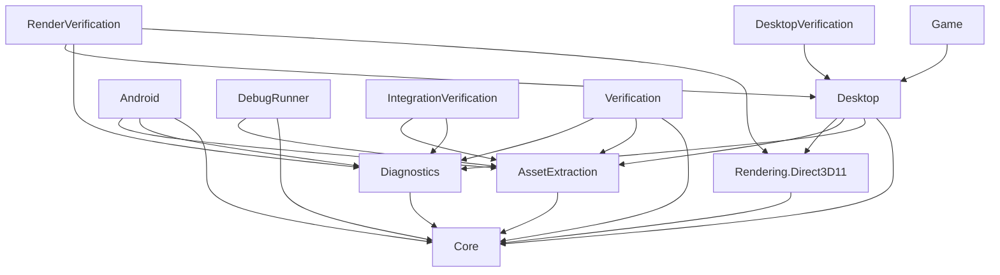

# Project inventory and consolidation

Updated September 10, 2026. There are **12 top-level C# projects**, down from 15:
seven production projects and five developer/verification projects. The consolidation
is implemented, not just recommended. Existing commits and history are preserved.

## Completed changes

- Desktop smoke tests and audit dispatch moved from the player into DesktopVerification
  (`115afce1`). Game retains its actual-startup DPI probe and normal replay support.
- AssetExtractionVerification and DiagnosticsVerification combined as IntegrationVerification
  (`c5581aed`). Release CI uses the explicit ROM-free `--asset-import` command.
- AssetExtractor commands moved into `DebugRunner assets`, including install, ROM/raw audio,
  replacement audio, maps, room images and PNG inventory (`0163a828`). The DebugRunner name
  and existing audit flags remain stable.
- RoomViewer was removed (`0163a828`). The user judged its forced-scenario and equipment
  controls unnecessary now that the game is completable; those controls were not ported.
- Portable Android session/import/policy services now compile once in Diagnostics. Tests and
  Android reference that assembly instead of linking Android project source.
- GameForm now belongs to Desktop, shared by Game and DesktopVerification. RenderVerification
  references Desktop for its audio adapters instead of compiling its own copies.
- Shared verification fixtures have an explicit owner under `csharp/test-support`, with
  selective MSBuild imports. No project compiles source owned by another top-level project.
- The default solution covers all 11 non-Android projects; the full solution covers all 12.

## Remaining projects

All names have the `SuperMetroid.` prefix.

| Project | Scope and reason to retain it |
| --- | --- |
| **Core** | Portable translated game logic, cartridge data, movement/combat, rooms, software rendering, audio simulation and ordinary save formats. Foundation shared by both apps. |
| **AssetExtraction** | Supported-ROM validation, header normalization, app-owned installation, runtime audio extraction and repair/recovery. Shared production library used by both apps and developer tools. |
| **Diagnostics** | Controller recordings, debugger-state serialization and compatibility, plus portable Android session, import/export, input preferences and lifecycle policy. Keeps these services testable without the Android SDK. |
| **Rendering.Direct3D11** | Windows GPU resources, shaders, rendering, readback, swapchains and render-worker coordination. Keeps platform dependencies away from Android and Core. |
| **Desktop** | Windows game window/control, input, timing, native audio, presentation, lifecycle and diagnostic integration. Owns GameForm and compiled audio adapters used by verification. |
| **Game** | Thin Windows executable: process/DPI setup, ROM selection, settings and launch/replay. Remains the actual player entry point. |
| **Android** | APK, Activity, document picker, controller integration, View, AudioTrack and platform lifecycle. Calls shared session services in Diagnostics and installer in AssetExtraction. |
| **DebugRunner** | Cartridge audits, reproductions, traces, coverage checks and fixture exports, plus the `assets` CLI. Preserves developer commands without adding them to the player or default regression run. |
| **Verification** | Broad core regressions, synthetic and private-ROM checks. Its default run still requires private ROM/map fixtures; it is not the ROM-free release check. |
| **IntegrationVerification** | Portable session/state/import verification, legacy compatibility and diagnostic commands. `--asset-import` alone is ROM-free; append ROM and optional reference audio for full installation checks. Default session tests require private ROM/audio. |
| **RenderVerification** | Hardware/WARP pixel comparisons, render-worker and swapchain tests, performance and audio/simulation consistency under GPU stalls. Runs independently of the WinForms lifecycle suite. |
| **DesktopVerification** | Windows STA/HWND lifecycle, input/audio smoke audits, state/resize/shutdown tests and timer soaks. Verifies actual production assemblies without shipping test code in the player. |

## Architecture

Player releases build only the Game or Android dependency trees. Developer project removal
simplifies maintenance; it does not itself shrink downloads that already excluded those tools.
Game/Desktop remains a useful entry-point/host boundary; no further merger is required.

[SuperMetroid.slnx](../csharp/SuperMetroid.slnx) is the default Windows/developer solution,
without an Android workload requirement. [SuperMetroid.Full.slnx](../csharp/SuperMetroid.Full.slnx)
also includes Android. Both group libraries, apps, tools and verification explicitly.

[Shared test support](../csharp/test-support/README.md) documents the three fixture groups.
They deliberately compile internal test types into their consumers and introduce no extra
runtime assembly. The common source audit remains under `csharp/tools`; the opt-in Android
host probe also remains there. Production source is consumed through project references.

Existing namespaces are retained, including the historical `SuperMetroid.Desktop` debugger
state identities and `SuperMetroid.Android` portable service names. Reflection-owned graph
classes remain in their existing Core/Diagnostics assemblies. GameForm and Android session
host objects are not serialized as debugger graphs.

## Verification

- Default and full Release solution builds passed with zero warnings/errors, including the
  Release AOT Android APK. No new on-device qualification was performed in this consolidation.
- ROM-free import validation and full private-ROM extraction passed, including exact reference
  parity, cancellation, installation repair/recovery and production Android-session startup.
- Default session integration and legacy schema migration passed: exact video/audio continuation,
  recording seeds, corrupt-state rejection, import/export and compatibility checks.
- All retained asset CLI operations ran successfully: installation, ROM/raw audio, replacement,
  seven area maps/262 placements, Landing Site image, and 1,130 chunks/723 PNG previews.
- Clean Game/DesktopVerification publishes passed identical production-DLL checks, exclusion of
  private assets/test types, actual Game DPI startup, six host audits, hidden lifecycle and soak.
- Moved minimap fixtures passed 160 exact frames per GPU backend. Slow-consumer audio tests
  passed on hardware and WARP with compiled Desktop adapters and exact runtime/PCM comparisons.
- Host policy/configuration checks and the existing magic-number source audit passed.

The previously identified legacy desktop `--state-audit` fixture mismatch (46 saved
SuperMetroidGame fields versus 47 current fields) remains a separate known issue. It was
reproduced before the earlier smoke-test separation; this consolidation does not claim to fix it.

## Outside the top-level project count

The fixture-local [Inspect.csproj](../csharp/test-fixtures/issue-329-330-player-states/inspect/Inspect.csproj)
is retained as a historical compatibility helper. Its adjacent legacy assemblies are private,
not tracked, and it is not part of either supported solution.

Repository `tools`, Python tests, release/Discord automation, hooks and documentation remain.
Ignored reference checkouts, ROM/audio assets, states, recordings and local workspaces are
private development inputs, not redundant application projects. Uncommitted user issue work
in the main checkout was preserved throughout this consolidation.
