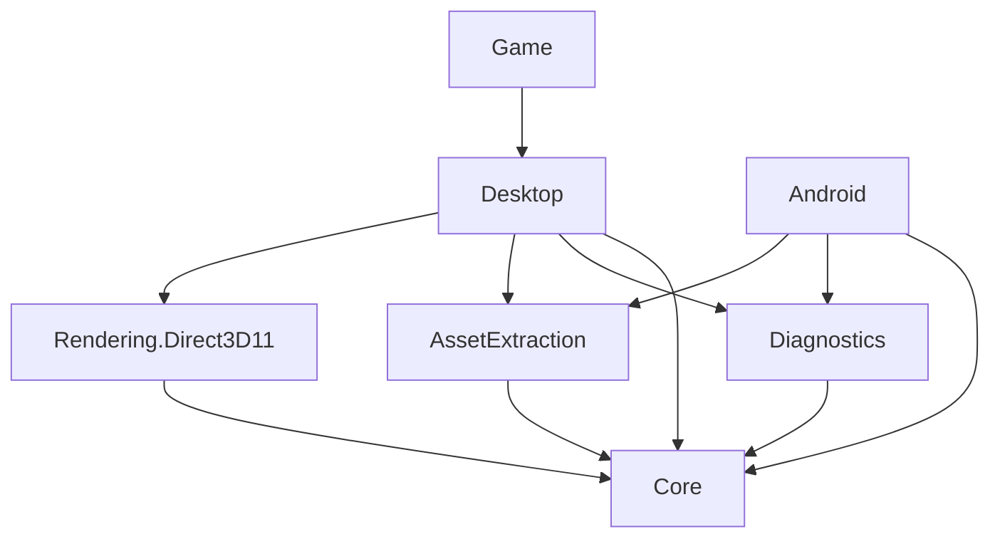

# Project inventory and consolidation review

Reviewed September 10, 2026, against committed revision
`945d1ac4c40082a8edbd6f30686c71b2f8f7579d`.

Implementation progress: the first cleanup step has moved the 12 standalone desktop
smoke-test files and the embedded keyboard smoke test into DesktopVerification, along with
their audit dispatch and private-ROM locator. The player retains its actual-entry-point DPI
probe. The inventory and counts below describe the original reviewed baseline; subsequent
consolidation steps remain recommendations.

The separation passed clean Game/DesktopVerification publishes, identical production-DLL
checks, metadata checks excluding smoke-test types/verification references, the real Game
DPI probe, six moved host audits, hidden software/GPU lifecycle tests and timer soak.
Managed audio (30 scenarios / 4,560 frames), pause audio, cartridge audio and waveOut audits
also passed. The metadata guard correctly rejects the pre-refactor Desktop assembly.
The legacy `--state-audit` still fails loading a preserved fixture with a 46-versus-47-field
SuperMetroidGame mismatch; the same failure was reproduced with the pre-refactor player
build. That existing compatibility issue was not changed or hidden by this separation.

## Recommendation

Keep the seven production projects. Consolidate two pairs of developer/test executables,
and retire the standalone RoomViewer once its useful diagnostic controls have replacements.
That gives a practical target of **12 projects instead of 15**. No project has been removed
by this review, and none of the 15 is proven to contain only dead code.

The more valuable cleanup is separating test code from shipped application code, making
test requirements explicit, and eliminating linked-source ownership between projects.
Reducing the number of development executables alone will not shrink the player downloads:
the release workflow already builds only the Game and Android dependency trees.

Scope: all 15 projects under `csharp/src`, the solution and release workflow, project
references and linked source, executable dispatchers, representative implementation files,
and the extra fixture-local project. This is a static architecture review, not an exhaustive
method-by-method dead-code analysis or a new runtime qualification. Uncommitted work in the
main checkout was observed but excluded from the committed baseline and left untouched.

## Every top-level C# project

All names below have the `SuperMetroid.` prefix. Source sizes count owned `.cs` files and
physical lines in the clean checkout, excluding linked files and build output. Sizes are
context, not an argument to remove code.

| Project | What it actually does | Needed? / recommendation | Owned source |
| --- | --- | --- | --- |
| **Core** | Translated game/frontend, room loading, cartridge address space, movement/combat/enemies, software rendering, audio driver/mixer, input and regular-save formats. Platform-neutral foundation. | **Keep.** Both apps and almost every tool depend on it. Use folders/domains to manage its size before adding more assemblies. | 735 files; 168,183 lines |
| **AssetExtraction** | Validates the supported ROM, normalizes copier headers, extracts runtime audio, installs/reuses/repairs app-owned content, and protects player data during replacement. | **Keep.** Both platforms need the same implementation; merging it into a CLI would break that boundary. | 7 files; 629 lines |
| **Diagnostics** | Records controller input and serializes/restores debugger states, including legacy type/field compatibility. Despite the name, these are active app features. | **Keep.** Shared by Windows and Android. Do not treat it as disposable logging or merge it into the Windows library. | 8 files; 1,102 lines |
| **Rendering.Direct3D11** | Windows GPU device/context ownership, shaders, packet rendering/readback, swapchain presentation and render-worker coordination. | **Keep.** A real platform/dependency boundary; Android must not inherit Direct3D or the Windows shader toolchain. | 25 files; 1,463 lines |
| **Desktop** | WinForms playable control, host input, timing, native audio delivery, presentation, state/replay integration and error handling. Also contains test helpers that should not live here. | **Keep, clean up contents.** It is the Windows host library, not a second game core. Move smoke tests out. | 30 files; 4,514 lines |
| **Game** | Windows executable: process/DPI setup, ROM selection, settings, game window, replay startup and numerous diagnostic command switches. | **Keep as the thin Windows entry point.** Move most audit switches to DesktopVerification. Merging with Desktop is possible later, but offers little immediate benefit. | 4 files; 595 lines |
| **Android** | APK/activity, document picker, controller bindings, lifecycle/audio focus, AudioTrack, rendering view, session loop and diagnostic import/export. | **Keep.** Separate SDK, lifecycle and packaging requirements make this an appropriate executable boundary. | 23 files; 1,638 lines |
| **AssetExtractor** | CLI for ROM installation/audio extraction and replacement, plus legacy raw-to-PNG, Landing Site image export and map export. Map export still uses the upstream symbol catalog. | **Consolidate its CLI into DebugRunner**, preferably renamed DeveloperTools. Keep extraction implementation in AssetExtraction. The command-line features remain useful even though players no longer need this executable. | 2 files; 556 lines |
| **DebugRunner** | Large command-driven collection of cartridge audits, reproductions, coverage checks, traces, fixture exports and debugging scenarios. | **Keep and organize as DeveloperTools.** Natural home for asset CLI commands. Do not delete its audits or simply fold all of them into the default regression run. | 301 files; 87,890 lines |
| **RoomViewer** | Interactive development UI: static Landing Site composition from raw assets plus a runtime-preview tab with stepping, scenario resets, equipment/input toggles and camera controls. It is not a general room editor. | **Retirement candidate, conditional.** No production consumer. Preserve useful preview/scenario capabilities in developer tooling before removing the project. Its static image export is already available through AssetExtractor. | 4 files; 1,416 lines |
| **Verification** | Broad core regression runner: synthetic/scalar-reference checks, retail-ROM regressions, rendering/audio/state tests and selected audit modes. Default execution is not ROM-free. | **Keep.** Organize suites by capability and required inputs. Avoid merging the much larger DebugRunner into it. | 205 files; 44,451 lines |
| **AssetExtractionVerification** | ROM-free invalid-input checks plus optional private-ROM extraction parity, repair/cancellation/recovery and production Android-session boot tests. | **Consolidate into DiagnosticsVerification**, renamed IntegrationVerification if desired. Preserve a fast, explicitly ROM-free import-validation command for release CI. | 1 file; 167 lines |
| **DiagnosticsVerification** | Portable tests of linked Android session/storage/import/command/mailbox code, exact state continuation and journals; also replay, fixture export and allocation/assembly checks. | **Keep as portable integration verification.** Absorb extraction tests. Some fixture-export commands could move to DeveloperTools separately. | 16 files; 1,316 lines |
| **RenderVerification** | Windows GPU/software pixel comparisons, hardware and WARP checks, rendering fixtures, swapchain/readback/thread ownership and renderer performance diagnostics. | **Keep.** GPU qualification is a different environment and failure class from portable core tests or the WinForms UI loop. | 48 files; 3,415 lines |
| **DesktopVerification** | WinForms integration tests using an STA message loop and HWNDs: startup/shutdown, resize, state load, render handoff, audio queues, and visible/hidden soak scenarios. Also contains issue reproductions. | **Keep.** Receive the desktop smoke tests currently shipped in Desktop/Game. Keep UI lifecycle tests separate from headless GPU comparisons. | 24 files; 1,862 lines |

## Production dependency boundaries

These are project references, including the current transitive route by which Game uses
the shared installer:

Evidence: the [Game](../csharp/src/SuperMetroid.Game/SuperMetroid.Game.csproj),
[Desktop](../csharp/src/SuperMetroid.Desktop/SuperMetroid.Desktop.csproj),
[Android](../csharp/src/SuperMetroid.Android/SuperMetroid.Android.csproj), and
[Direct3D11](../csharp/src/SuperMetroid.Rendering.Direct3D11/SuperMetroid.Rendering.Direct3D11.csproj)
project files. The [release workflow](../.github/workflows/release.yml) publishes only the
two player executables; development projects are not automatically included just because
they appear in a solution.

## Specific problems worth addressing

### Tests are compiled into the desktop application library

Desktop contains at least 12 dedicated `*SmokeTest.cs` files, including audio/replay,
debugger-state, viewport, bitmap, timing and error-reporter checks. Its SDK-style project
includes them as ordinary production source. [Game/Program.cs](../csharp/src/SuperMetroid.Game/Program.cs)
dispatches their audit commands alongside normal player startup.

Move test-only implementations and audit dispatch to DesktopVerification. Retain production
services such as the actual error reporter, native audio device and playable control in
Desktop. Preserve externally used command equivalents and update the developer docs.
Do not move all diagnostic functionality out of the app: its player-facing state slots,
recording, error handling and Android testing menu are intentional features.

### The default solution is incomplete

[SuperMetroid.slnx](../csharp/SuperMetroid.slnx) lists 13 of the 15 projects. It omits
**Android** and **DiagnosticsVerification**. Android is still built directly by the release
workflow, but a solution build does not validate the complete repository.

Make that choice explicit: maintain a full development solution and a workload-light
solution/filter, or clearly label the current solution's scope. Organize apps, libraries,
tools and verification into solution folders. Do not add an Android workload requirement
to every contributor's default build accidentally.

### Several test assemblies compile source owned by other projects

- Verification links three Android policy/preference/setting files and the magic-number audit.
- DiagnosticsVerification links seven Android session/helper files and a fixture loader from DesktopVerification.
- AssetExtractionVerification links two of those same Android files.
- DesktopVerification links GameForm and a native-error helper from RenderVerification.
- RenderVerification links four DebugRunner fixtures and two Desktop audio helper files.
- DebugRunner also links the magic-number audit.

See the respective `.csproj` `Compile Include` entries. These are linked copies of the same
source, not independent hand-maintained duplicates. Nevertheless, ownership and dependency
discovery are obscured, and the same types compile into multiple assemblies. The portable
Android links currently allow tests to exercise real production code without an Android SDK;
replace that benefit deliberately rather than deleting the links first.

Combining the two portable integration runners removes some duplication immediately.
Then move genuinely reusable portable session services into an appropriate shared production
owner after defining its API; keep platform Activity/View/AudioTrack code in Android.
Move shared test-only fixtures to one explicit test-support owner if reuse justifies it.
A small support library can be worthwhile even if it adds one project back.

### Test runners mix independent requirements

Verification's default path calls retail-ROM checks, including
[VerifyBoostFloorScroll](../csharp/src/SuperMetroid.Verification/Program.BoostFloorScroll.cs),
and requires generated map assets in
[VerifyAreaMapAssets](../csharp/src/SuperMetroid.Verification/Program.AreaMapAssets.cs).
DiagnosticsVerification's default session tests also use local ROM/audio inputs. In contrast,
AssetExtractionVerification has an explicitly ROM-free mode used by release CI.

Preserve these distinctions during consolidation: synthetic tests, private-ROM integration,
GPU tests, WinForms tests and on-device tests need explicit commands/requirements. A merge
must not silently remove the release pipeline's ability to validate without game assets.

### Some names are historical, not evidence of redundant code

Diagnostics intentionally retains the `SuperMetroid.Desktop` namespace for persisted state
identities. [DebuggerStateTypeIdentity](../csharp/src/SuperMetroid.Diagnostics/DebuggerStateTypeIdentity.cs)
contains explicit migrations for older assembly/type names. Renaming or merging assemblies
that own serialized types requires compatibility tests against existing states. Namespace
cleanup alone is not a sufficient reason to alter this boundary.

Core also contains developer-facing helpers, such as its raw-file
[RoomRenderer](../csharp/src/SuperMetroid.Core/Rooms/RoomRenderer.cs). The inspected direct
`RoomRenderer.Render` callers are AssetExtractor and RoomViewer. This is a candidate for
moving to developer extraction code if RoomViewer is retired; shared room/data types need
a separate usage audit first. Do not move general graphics decoding or compression out of
Core just because extraction tools use them: runtime code needs those too.

## Extra project and repository-root workspaces

The tracked fixture-local
[Inspect.csproj](../csharp/test-fixtures/issue-329-330-player-states/inspect/Inspect.csproj)
is outside the main 15. It references fixture-adjacent Core/Desktop DLLs directly and uses
reflection to load an older Desktop-owned debugger state. Those DLLs are not tracked in
the current checkout. **Treat it as a historical compatibility helper, not a supported
top-level app.** Preserve its explanation; consolidate any still-needed inspection operation
into DeveloperTools or IntegrationVerification before retiring the old project.

The repository's other root directories are not competing C# application projects:

| Root area | Purpose and recommendation |
| --- | --- |
| `tools/`, `tests/` | Python ROM inspection, release packaging/Discord notification, commit-update tracking, publication-history migration, and their tests. Keep active automation here. Publication migration is a maintenance tool rather than part of a game build. No benefit from forcing these scripts into a C# project. |
| `csharp/tools/` | Publish-verification scripts, audits and Android probes. Keep as development support; update project paths when consolidating. |
| `upstream-sm/`, `upstream-disassembly/`, `standalone-native/` | Ignored reference checkouts/native comparison workspace. Not required for the published player apps, but some audits/export commands still use them. Keep optional and reproducible; do not indiscriminately delete local references. |
| `standalone-assets/` | Ignored generated developer fixtures/assets. Normal app setup now generates runtime resources in app storage; legacy tooling/tests still reference this directory. It is not a project to merge. |
| `debug-states/`, `input-recordings/`, local ROM/save files | Private user/test data. Not build projects or deletion candidates for this cleanup. |
| `.github/`, `.githooks/`, `.agents/`, `.worktrees/`, `docs/` | Automation, instructions, isolated checkouts and documentation. Keep according to their roles; they are not duplicate applications. |

## Proposed implementation order

1. Move dedicated desktop smoke tests/audit entry points into DesktopVerification. Keep
   normal game startup, replay and player diagnostic features working.
2. Combine AssetExtractionVerification and DiagnosticsVerification into a portable
   IntegrationVerification runner with a preserved ROM-free command. Update release CI,
   solution coverage, friend assemblies and documentation together.
3. Fold AssetExtractor commands into DebugRunner/DeveloperTools under clear subcommands.
   Keep AssetExtraction as the small shared production library. Preserve useful CLI behavior.
4. Inventory which RoomViewer scenario controls developers still use. Port those capabilities
   before retiring its executable; do not assume Game's ordinary play/step UI replaces every
   forced scenario and equipment toggle.
5. Address linked test fixtures/session ownership and organize the solutions. Revisit merging
   Game with Desktop only if the remaining separation no longer serves tooling or tests.

Before each removal, verify equivalent commands/reproductions, update project/script/docs
references, and run tests appropriate to the affected platform. For assembly/type movement,
include old state compatibility; for installer test consolidation, include the ROM-free
release check. Preserve existing history. This report recommends the changes but does not
authorize or perform source deletion.
